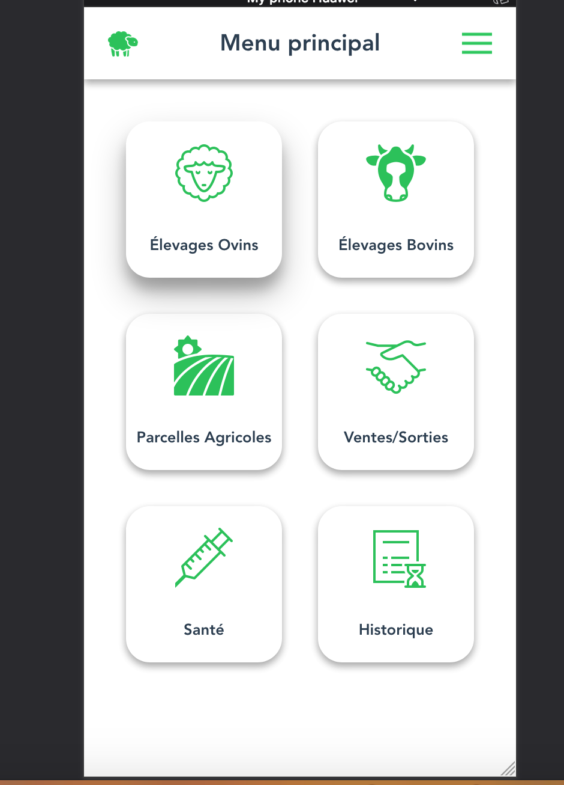

# Application - Etchebestia

L'application Etchebestia est une solution de gestion agricole , qui vise à aider les agriculteurs dans la gestion de leur exploitation agricole.

  - Gestion de troupeaux
  - Gestion de parcelles
  - Fiches santé
  - Gestion productions laitières
  - Indicateurs météorologiques

### Tech

Dillinger uses a number of open source projects to work properly:
Etchebestia a été developpé avec la stack MEVN ( MongoDB, Express, VueJs, Nodejs) :

* [VueJs](https://vuejs.org/) 
* [Nodejs](https://nodejs.org/en/)
* [Express](https://expressjs.com/fr/)
* [MongoDB](https://www.mongodb.com/fr) 

### Installation

Etchebestia nécessite Node.js (v: 10+) , et MongoDB (v: 3.6+).

Installation des dépendances et devDependencies puis démarrer l'application ( client et serveur ).

```sh
$ npm install
$ npm run init-project
$ npm run dev
```
### Screenshots 



### Todos

 - Modules Santé
 - Modules Ventes/Sorties
 - Modules Historique

License
----

MIT

